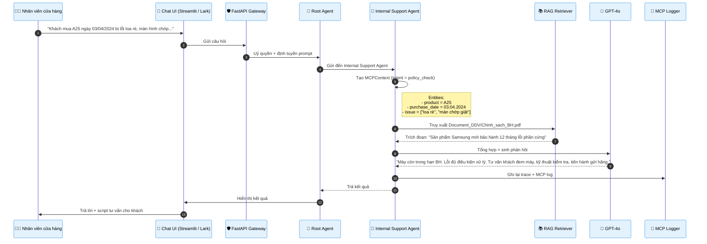
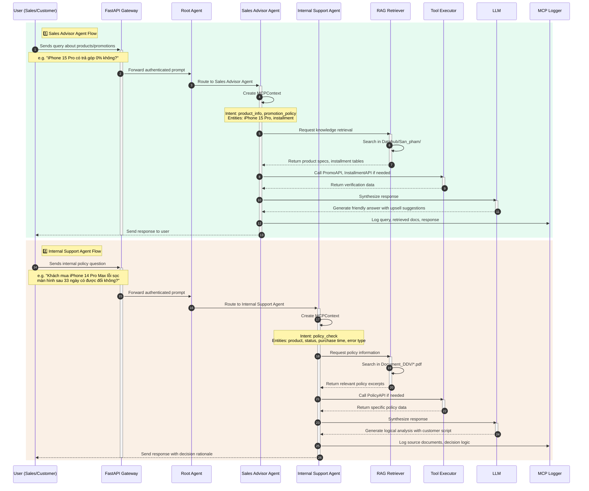
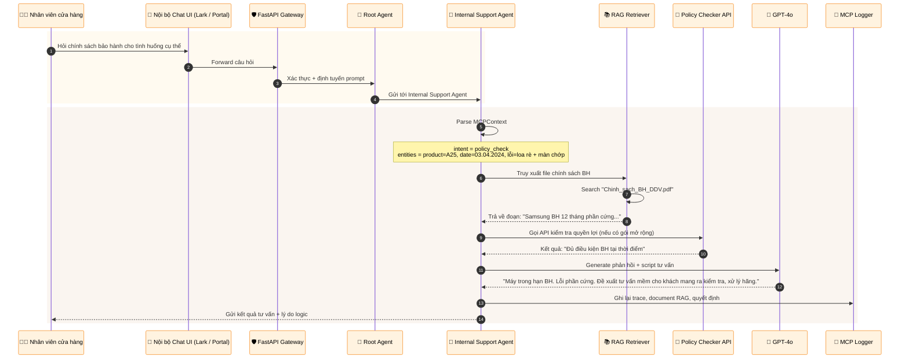
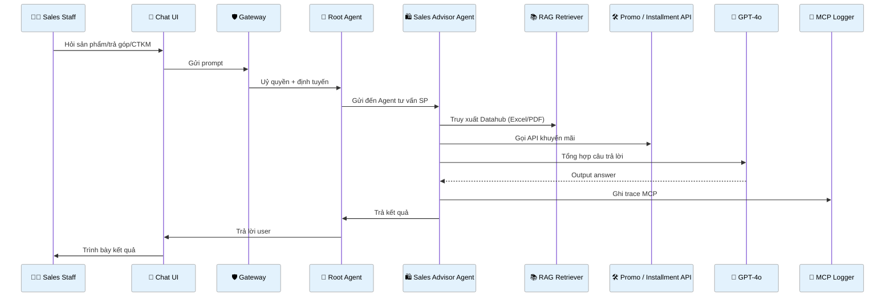
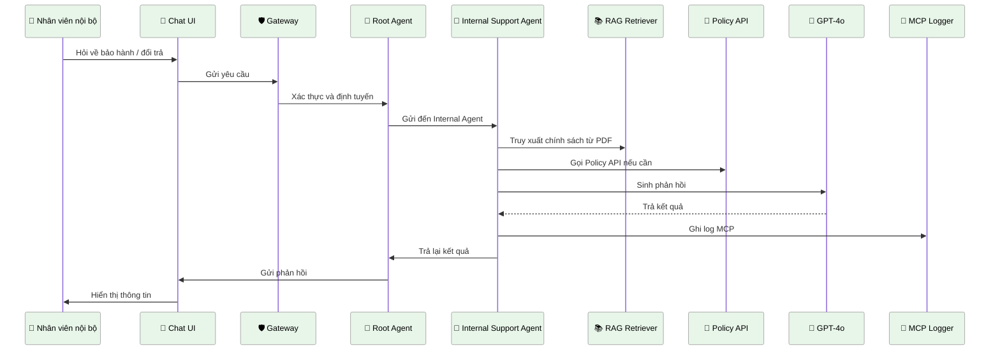

```mermaid
%%{init: {"theme": "default", "themeVariables": {
  "actorBkg": "#e3f2fd",
  "actorBorder": "#1e88e5",
  "primaryColor": "#1565c0"
}}}%%

sequenceDiagram
    autonumber
    participant Staff as 🧑‍💼 Nhân viên cửa hàng
    participant UI as 💬 Chat UI (Streamlit / Lark)
    participant Gateway as 🛡️ FastAPI Gateway
    participant Root as 🧠 Root Agent
    participant Internal as 🏢 Internal Support Agent
    participant RAG as 📚 RAG Retriever
    participant LLM as 🤖 GPT-4o
    participant Logger as 📝 MCP Logger

    Staff->>UI: "Khách mua A25 ngày 03/04/2024 bị lỗi loa rè, màn hình chớp..."
    UI->>Gateway: Gửi câu hỏi
    Gateway->>Root: Uỷ quyền + định tuyến prompt
    Root->>Internal: Gửi đến Internal Support Agent

    Internal->>Internal: Tạo MCPContext (intent = policy_check)
    Note right of Internal: Entities:<br>- product = A25<br>- purchase_date = 03.04.2024<br>- issue = ["loa rè", "màn chớp giật"]

    Internal->>RAG: Truy xuất Document_DDV/Chinh_sach_BH.pdf
    RAG-->>Internal: Trích đoạn: "Sản phẩm Samsung mới bảo hành 12 tháng lỗi phần cứng"
    
    Internal->>LLM: Tổng hợp + sinh phản hồi
    LLM-->>Internal: "Máy còn trong hạn BH. Lỗi đủ điều kiện xử lý. Tư vấn khách đem máy, kỹ thuật kiểm tra, tiến hành gửi hãng."

    Internal->>Logger: Ghi lại trace + MCP log
    Internal-->>Root: Trả kết quả
    Root->>UI: Hiển thị kết quả
    UI->>Staff: Trả lời + script tư vấn cho khách
```

```mermaid
sequenceDiagram
    autonumber
    participant User as User (Sales/Customer)
    participant Gateway as FastAPI Gateway
    participant Root as Root Agent
    participant Sales as Sales Advisor Agent
    participant Internal as Internal Support Agent
    participant RAG as RAG Retriever
    participant Tools as Tool Executor
    participant LLM as LLM
    participant Logger as MCP Logger
    
    %% Color coding
    rect rgb(230, 250, 240)
    note right of User: 1️⃣ Sales Advisor Agent Flow
    
    %% Sales Advisor Agent Workflow
    User->>+Gateway: Sends query about products/promotions
    Note over User,Gateway: e.g. "iPhone 15 Pro có trả góp 0% không?"
    Gateway->>Root: Forward authenticated prompt
    Root->>+Sales: Route to Sales Advisor Agent
    
    Sales->>Sales: Create MCPContext
    Note over Sales: Intent: product_info, promotion_policy<br>Entities: iPhone 15 Pro, installment
    
    Sales->>RAG: Request knowledge retrieval
    activate RAG
    RAG->>RAG: Search in Datahub/San_pham/
    RAG-->>-Sales: Return product specs, installment tables
    
    Sales->>Tools: Call PromoAPI, InstallmentAPI if needed
    activate Tools
    Tools-->>-Sales: Return verification data
    
    Sales->>LLM: Synthesize response
    activate LLM
    LLM-->>-Sales: Generate friendly answer with upsell suggestions
    
    Sales->>Logger: Log query, retrieved docs, response
    Sales-->>-User: Send response to user
    deactivate Gateway
    end
    
    %% Internal Support Agent Workflow
    rect rgb(250, 240, 230)
    note right of User: 2️⃣ Internal Support Agent Flow
    User->>+Gateway: Sends internal policy question
    Note over User,Gateway: e.g. "Khách mua iPhone 14 Pro Max lỗi sọc<br>màn hình sau 33 ngày có được đổi không?"
    Gateway->>Root: Forward authenticated prompt
    Root->>+Internal: Route to Internal Support Agent
    
    Internal->>Internal: Create MCPContext
    Note over Internal: Intent: policy_check<br>Entities: product, status, purchase time, error type
    
    Internal->>RAG: Request policy information
    activate RAG
    RAG->>RAG: Search in Document_DDV/*.pdf
    RAG-->>-Internal: Return relevant policy excerpts
    
    Internal->>Tools: Call PolicyAPI if needed
    activate Tools
    Tools-->>-Internal: Return specific policy data
    
    Internal->>LLM: Synthesize response
    activate LLM
    LLM-->>-Internal: Generate logical analysis with customer script
    
    Internal->>Logger: Log source documents, decision logic
    Internal-->>-User: Send response with decision rationale
    deactivate Gateway
    end
```

```mermaid
%%{init: {"theme": "default", "themeVariables": {
  "actorBkg": "#e3f2fd",
  "actorBorder": "#1e88e5",
  "primaryColor": "#1565c0"
}}}%%

sequenceDiagram
    autonumber
    participant Staff as 🧑‍💼 Nhân viên cửa hàng
    participant UI as 💬 Chat UI (Streamlit / Lark)
    participant Gateway as 🛡️ FastAPI Gateway
    participant Root as 🧠 Root Agent
    participant Internal as 🏢 Internal Support Agent
    participant RAG as 📚 RAG Retriever
    participant LLM as 🤖 GPT-4o
    participant Logger as 📝 MCP Logger

    Staff->>UI: "Khách mua A25 ngày 03/04/2024 bị lỗi loa rè, màn hình chớp..."
    UI->>Gateway: Gửi câu hỏi
    Gateway->>Root: Uỷ quyền + định tuyến prompt
    Root->>Internal: Gửi đến Internal Support Agent

    Internal->>Internal: Tạo MCPContext (intent = policy_check)
    Note right of Internal: Entities:<br>- product = A25<br>- purchase_date = 03.04.2024<br>- issue = ["loa rè", "màn chớp giật"]

    Internal->>RAG: Truy xuất Document_DDV/Chinh_sach_BH.pdf
    RAG-->>Internal: Trích đoạn: "Sản phẩm Samsung mới bảo hành 12 tháng lỗi phần cứng"
    
    Internal->>LLM: Tổng hợp + sinh phản hồi
    LLM-->>Internal: "Máy còn trong hạn BH. Lỗi đủ điều kiện xử lý. Tư vấn khách đem máy, kỹ thuật kiểm tra, tiến hành gửi hãng."

    Internal->>Logger: Ghi lại trace + MCP log
    Internal-->>Root: Trả kết quả
    Root->>UI: Hiển thị kết quả
    UI->>Staff: Trả lời + script tư vấn cho khách

```

```mermaid
%%{init: {"theme": "default", "themeVariables": {
  "actorBkg": "#fff3e0",
  "actorBorder": "#f57c00",
  "primaryColor": "#ef6c00"
}}}%%

sequenceDiagram
    autonumber
    participant Staff as 🧑‍💼 Nhân viên cửa hàng
    participant InternalUI as 💬 Nội bộ Chat UI (Lark / Portal)
    participant Gateway as 🛡️ FastAPI Gateway
    participant Root as 🧠 Root Agent
    participant Internal as 🏢 Internal Support Agent
    participant RAG as 📚 RAG Retriever
    participant Tools as 🔧 Policy Checker API
    participant LLM as 🤖 GPT-4o
    participant Logger as 📜 MCP Logger

    rect rgb(255,250,240)
    Staff->>InternalUI: Hỏi chính sách bảo hành cho tình huống cụ thể
    InternalUI->>Gateway: Forward câu hỏi
    Gateway->>Root: Xác thực + định tuyến prompt
    Root->>Internal: Gửi tới Internal Support Agent
    end

    rect rgb(250,245,240)
    Internal->>Internal: Parse MCPContext
    Note over Internal: intent = policy_check<br>entities = product=A25, date=03.04.2024, lỗi=loa rè + màn chớp

    Internal->>RAG: Truy xuất file chính sách BH
    RAG->>RAG: Search "Chinh_sach_BH_DDV.pdf"
    RAG-->>Internal: Trả về đoạn: "Samsung BH 12 tháng phần cứng..."

    Internal->>Tools: Gọi API kiểm tra quyền lợi (nếu có gói mở rộng)
    Tools-->>Internal: Kết quả: "Đủ điều kiện BH tại thời điểm"

    Internal->>LLM: Generate phản hồi + script tư vấn
    LLM-->>Internal: "Máy trong hạn BH. Lỗi phần cứng. Đề xuất tư vấn mềm cho khách mang ra kiểm tra, xử lý hãng."

    Internal->>Logger: Ghi lại trace, document RAG, quyết định
    Internal-->>Staff: Gửi kết quả tư vấn + lý do logic
    end

```

```mermaid
%%{init: {"theme":"default","themeVariables": {
  "actorTextColor": "#000",
  "actorBorder": "#999",
  "actorBkg": "#e3f2fd",
  "primaryColor": "#1976d2",
  "edgeLabelBackground":"#fff",
  "sequenceMessageColor":"#0d47a1"
}}}%%

sequenceDiagram
    participant User as 🧑‍💼 Sales Staff
    participant UI as 💬 Chat UI
    participant Gateway as 🛡️ Gateway
    participant Core as 🧠 Root Agent
    participant Agent as 🛍️ Sales Advisor Agent
    participant RAG as 📚 RAG Retriever
    participant Tool as 🛠️ Promo / Installment API
    participant LLM as 🤖 GPT-4o
    participant Logger as 📝 MCP Logger

    User ->> UI: Hỏi sản phẩm/trả góp/CTKM
    UI ->> Gateway: Gửi prompt
    Gateway ->> Core: Uỷ quyền + định tuyến
    Core ->> Agent: Gửi đến Agent tư vấn SP
    Agent ->> RAG: Truy xuất Datahub (Excel/PDF)
    Agent ->> Tool: Gọi API khuyến mãi
    Agent ->> LLM: Tổng hợp câu trả lời
    LLM -->> Agent: Output answer
    Agent ->> Logger: Ghi trace MCP
    Agent ->> Core: Trả kết quả
    Core ->> UI: Trả lời user
    UI ->> User: Trình bày kết quả

```

```mermaid
%%{init: {"theme":"default","themeVariables": {
  "actorTextColor": "#000",
  "actorBorder": "#999",
  "actorBkg": "#e8f5e9",
  "primaryColor": "#388e3c",
  "edgeLabelBackground":"#fff",
  "sequenceMessageColor":"#1b5e20"
}}}%%

sequenceDiagram
    participant Staff as 🏢 Nhân viên nội bộ
    participant UI as 💬 Chat UI
    participant Gateway as 🛡️ Gateway
    participant Core as 🧠 Root Agent
    participant Agent as 🏢 Internal Support Agent
    participant RAG as 📚 RAG Retriever
    participant Tool as 🔧 Policy API
    participant LLM as 🤖 GPT-4o
    participant Logger as 📝 MCP Logger

    Staff ->> UI: Hỏi về bảo hành / đổi trả
    UI ->> Gateway: Gửi yêu cầu
    Gateway ->> Core: Xác thực và định tuyến
    Core ->> Agent: Gửi đến Internal Agent
    Agent ->> RAG: Truy xuất chính sách từ PDF
    Agent ->> Tool: Gọi Policy API nếu cần
    Agent ->> LLM: Sinh phản hồi
    LLM -->> Agent: Trả kết quả
    Agent ->> Logger: Ghi log MCP
    Agent ->> Core: Trả lại kết quả
    Core ->> UI: Gửi phản hồi
    UI ->> Staff: Hiển thị thông tin

```
