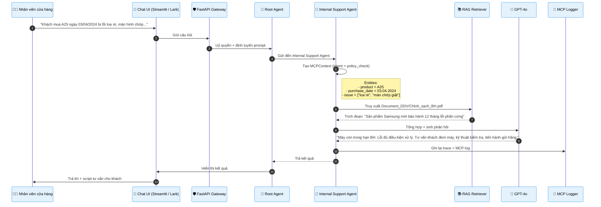
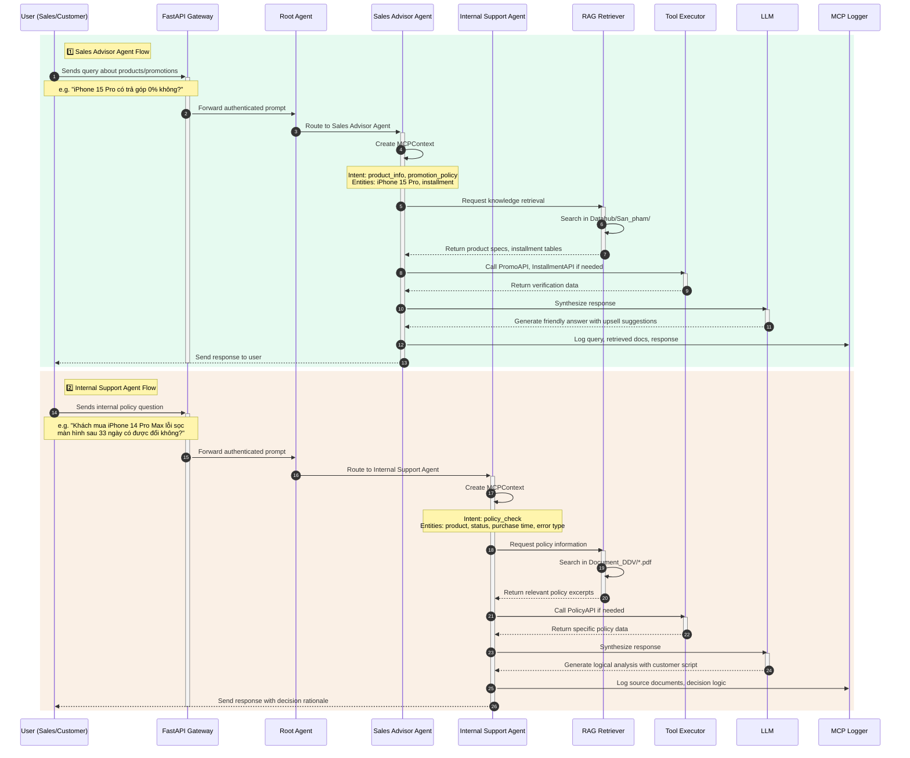
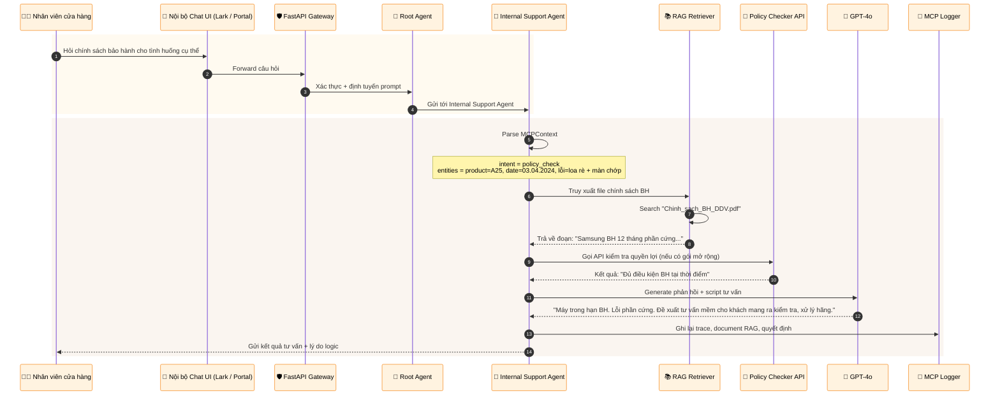
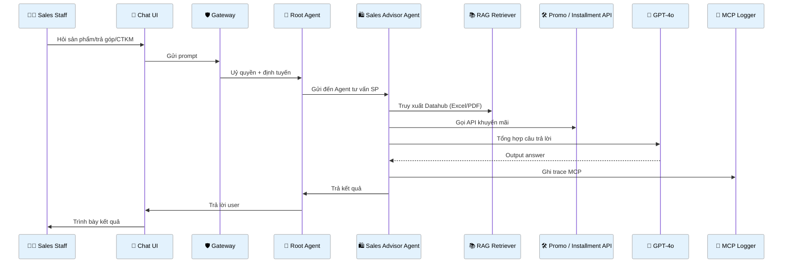
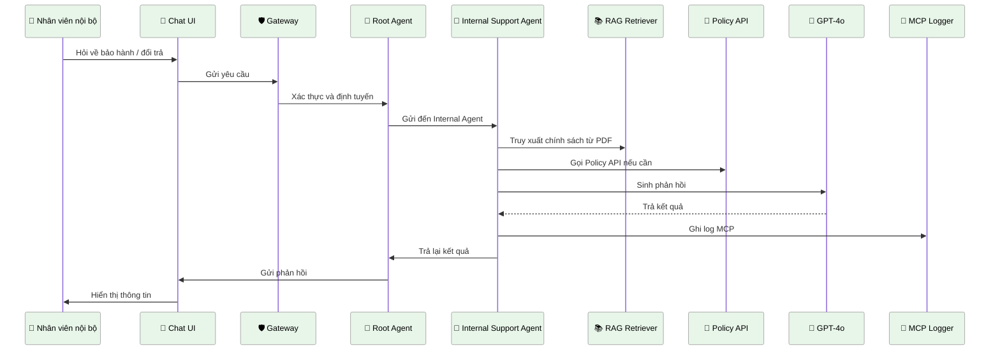

# Agentic Copilot MVP: Retail Edition

## 🌐 Mục tiêu

Xây dựng một hệ thống AI Agent để hỗ trợ nhân viên bán hàng và CSKH trong doanh nghiệp bán lẻ (Retail), đặc biệt là trong ngành điện thoại di động.

## ⚡ Kiến trúc chuẩn hóa

```
agentic-copilot-mvp/
├— README.md
├— docker-compose.yml
├— .env.example
├— requirements.txt

├— gateway/                ➜ API Gateway (FastAPI)
│   ├— main.py              ➜ Khởi chạy FastAPI
│   ├— routes.py            ➜ Định tuyến API
│   ├— auth.py              ➜ Xác thực JWT, vai trò
│   └— rate_limiter.py      ➜ Shield spam/abuse

├— orchestrator/          ➜ ADK Orchestrator Agent
│   ├— root_agent.py        ➜ Root Agent + Workflow logic
│   ├— a2a_protocol.py       ➜ Giao tiếp giữa agents
│   └— mcp_router.py        ➜ Liên kết LLM + RAG + Tools

├— agents/
│   └— product_agent.py     ➜ Tư vấn sản phẩm, CTKM
│   └— policy_agent.py      ➜ Trợ lý bảo hành, đổi trả

├— mcp_context/           ➜ MCP Protocol & Trace
│   ├— base_schema.py
│   ├— context_builder.py
│   ├— schemas/
│   │   ├— product_agent.json
│   │   └— policy_agent.json
│   └— logger.py

├— rag/                    ➜ RAG Retrieval Layer
│   ├— embed.py            ➜ Huggingface Embedding
│   ├— retriever.py        ➜ Chroma / Weaviate
│   └— documents/
│       └— product_knowledge/ & policies/

├— tools/                  ➜ Tool API (Mock or Real)
│   ├— product_tool.py
│   └— policy_tool.py

├— memory/                ➜ Short-term / Long-term memory
│   ├— redis_memory.py     ➜ Redis
│   ├— vector_memory.py    ➜ FAISS / Chroma
│   └— task_trace.py       ➜ Theo dõi task

├— cache/                 ➜ Cache GPT, RAG, Tool
│   ├— gpt_cache.py
│   ├— rag_cache.py
│   └— tool_cache.py

├— ui/                    ➜ Streamlit UI / Chat
│   ├— app.py
│   └— components/
│       └— chat_box.py

├— config/                ➜ Config trung tâm
│   ├— settings.py
│   └— secrets_template.json

├— tests/                 ➜ Unit Test
│   ├— test_gateway.py
│   ├— test_agents.py
│   └— test_rag.py

└— cicd/                  ➜ CI/CD
    ├— github_actions.yml
    └— dockerfiles/
        ├— gateway.Dockerfile
        └— agent_core.Dockerfile
```


# 📦 `agentic-copilot-mvp/` - Module Overview (Retail AI Copilot)

This document provides a structured overview of all modules and scripts in the `agentic-copilot-mvp` system.

| **Module**          | **Script/File**                 | **Description** |
|---------------------|----------------------------------|------------------|
| `gateway/`          | `main.py`                        | Start FastAPI server with middleware. |
|                     | `routes.py`                      | API routes: `/chat`, `/agent`, `/health`. |
|                     | `auth.py`                        | JWT, OAuth2 authentication and role validation. |
|                     | `rate_limiter.py`                | Limit API requests to prevent abuse. |
| `orchestrator/`     | `root_agent.py`                  | Root agent orchestrator logic. |
|                     | `a2a_protocol.py`                | Agent-to-agent communication protocol. |
|                     | `mcp_router.py`                  | Orchestrate LLM, Tools, RAG using MCP context. |
| `agents/`           | `product_agent.py`               | Agent for product and promotion queries. |
|                     | `policy_agent.py`                | Agent for warranty, return/exchange policies. |
| `mcp_context/`      | `base_schema.py`                 | Base MCP schema class. |
|                     | `context_builder.py`             | Build MCPContext object from input prompt. |
|                     | `logger.py`                      | Log MCP trace, decisions, tools used. |
|                     | `schemas/product_agent.json`     | MCP schema for product agent. |
|                     | `schemas/policy_agent.json`      | MCP schema for policy agent. |
| `rag/`              | `embed.py`                       | Embed documents using SBERT/OpenAI. |
|                     | `retriever.py`                   | Retrieve text from VectorDB. |
|                     | `documents/product_knowledge/`   | Product data (Excel, PDF). |
|                     | `documents/policies/`            | Policy documents for internal support. |
| `tools/`            | `product_tool.py`                | Mocked API for promotion and installment. |
|                     | `policy_tool.py`                 | Mocked API for warranty and return validation. |
| `memory/`           | `redis_memory.py`                | Redis-based short-term session memory. |
|                     | `vector_memory.py`               | Long-term semantic memory using FAISS/Chroma. |
|                     | `task_trace.py`                  | Track agent execution across user sessions. |
| `cache/`            | `gpt_cache.py`                   | Cache OpenAI GPT responses. |
|                     | `rag_cache.py`                   | Cache for retrieved documents. |
|                     | `tool_cache.py`                  | Cache tool responses (mocked or real). |
| `ui/`               | `app.py`                         | Streamlit interface to interact with agents. |
|                     | `components/chat_box.py`         | Chat box component UI. |
| `config/`           | `settings.py`                    | Central configuration and environment variables. |
|                     | `secrets_template.json`          | Example secret file for dev setup. |
| `tests/`            | `test_gateway.py`                | Unit tests for API gateway. |
|                     | `test_agents.py`                 | Tests for agent decision logic. |
|                     | `test_rag.py`                    | Tests for RAG document retrieval. |
| `cicd/`             | `github_actions.yml`             | GitHub Actions for CI/CD. |
|                     | `dockerfiles/gateway.Dockerfile` | Docker setup for Gateway. |
|                     | `dockerfiles/agent_core.Dockerfile`| Docker for agent core service. |
| `analytics/`        | `metrics_collector.py`           | Collect usage and latency metrics. |
|                     | `feedback_logger.py`             | Log user feedback and scores. |
|                     | `user_stats.py`                  | Aggregate session statistics. |
| `eventbus/`         | `producer.py`                    | Publish events for async tasks. |
|                     | `consumer.py`                    | Listen to events (Kafka/Redis) for background work. |
| `scripts/`          | `init_embed.py`                  | Embed full Datahub knowledge base. |
|                     | `test_agent.py`                  | CLI agent testing script. |
| `docs/`             | `api_docs.md`                    | Markdown documentation for all endpoints. |

## 📊 Chức năng của Agents

### ạ. `product_agent.py`

* Truy vấn sản phẩm từ DataHub (Excel/PDF)
* Tư vấn giá, chi nhánh, khuyến mãi
* Hỗ trợ nhân viên hoặc khách hàng cuối

### ạ. `policy_agent.py`

* Trích luật bảo hành, đổi trả từ Document\_DDV
* Trả lời câu hỏi logic, truy vết đến file nguồn
* Tổng hợp các kịch bản xử lý với khách

## ✅ Hướng dẫn chạy local

```bash
# Cài môi trường
cp .env.example .env
python -m venv .venv && source .venv/bin/activate
pip install -r requirements.txt

# Nhúng documents
python rag/embed.py

# Khởi động FastAPI + Agent
uvicorn gateway.main:app --reload

# Chạy UI
streamlit run ui/app.py
```

## 📕 Roadmap 2 ngày

| Ngày   | Mô tả                                            | Output                                 |
| ------ | ------------------------------------------------ | -------------------------------------- |
| Ngày 1 | Tạo base repo, build agent, load Datahub.zip     | Base repo chạy local, RAG embed xong   |
| Ngày 2 | Hook 2 Agents, test MCP + UI, add PromptTemplate | Agents trả lời thực tế + deploy Docker |

---

Sếp muốn mở rộng RAG-AAS hoặc integration với Claude/Rowboat em triển tiếp nha!
















# Tình huống: Workflow của 2 Agent chính
1️⃣ Sales Advisor Agent (Tư vấn sản phẩm + khuyến mãi)
🎯 Mục tiêu:
Hỗ trợ tư vấn sản phẩm, chính sách khuyến mãi, trả góp, phụ kiện... cho nhân viên bán hàng hoặc khách hàng cuối.

🔁 Luồng làm việc:
🧑‍💼 Người dùng (Sales hoặc khách hàng) gửi câu hỏi:

“iPhone 15 Pro có trả góp 0% không?”

“So sánh iPhone 15 vs 14 Pro Max?”

💬 Prompt được chuyển đến FastAPI Gateway, xác thực quyền truy cập.

🧠 Root Agent nhận prompt, định tuyến đến Sales Advisor Agent.

📜 Agent tự động tạo MCPContext bao gồm:

Intent: product_info, compare, promotion_policy

Entities: iPhone 15, 14 Pro Max, installment

📚 Agent kích hoạt RAG Retriever để tìm kiến thức từ Datahub/San_pham/:

Tìm file Excel/PDF có bảng trả góp, thông số sản phẩm

Truy vấn khuyến mãi hiện hành

🔧 Nếu cần xác thực thêm:

Gọi PromoAPI, InstallmentAPI qua Tool Executor

🤖 LLM tổng hợp lại kết quả, sinh câu trả lời thân thiện:

Có thể gợi ý combo upsell (ốp, sạc), highlight chính sách trả góp

📝 MCP Logger lưu lại: câu hỏi, tài liệu được truy xuất, câu trả lời

📤 Gửi lại cho người dùng

2️⃣ Internal Support Agent (Trả lời bảo hành, đổi trả, chính sách nội bộ)
🎯 Mục tiêu:
Cung cấp nhanh chính sách bảo hành/đổi trả từ tài liệu nội bộ (Datahub/Document_DDV) cho nhân viên.

🔁 Luồng làm việc:
🧑‍💼 Nhân viên gửi tình huống:

“Khách mua iPhone 14 Pro Max lỗi sọc màn hình sau 33 ngày có được đổi không?”

Gateway → Root Agent định tuyến đến Internal Support Agent

📜 Agent tạo MCPContext:

Intent: policy_check

Entities: sản phẩm, tình trạng, thời gian mua, loại lỗi

📚 RAG truy xuất chính sách từ Document_DDV/*.pdf:

Trích đoạn văn bản gốc có nội dung liên quan

🔧 Gọi PolicyAPI nếu cần lấy chính sách đặc thù (ví dụ: đổi trả riêng của dòng Likenew)

🤖 LLM tổng hợp nội dung:

Phân tích theo logic (thời gian, điều kiện đủ đổi)

Soạn sẵn kịch bản thuyết phục khách

📁 Tài liệu nguồn được ghi log, trích dẫn trong phản hồi

📤 Gửi câu trả lời kèm logic ra quyết định cho nhân viên

✅ Tính năng bổ sung (cho cả hai agent)
Thành phần	Vai trò
Memory Manager	Nhớ lịch sử tương tác, session giữa user và agent, dùng để giữ ngữ cảnh cuộc hội thoại.
Cache Layer	Lưu lại kết quả truy vấn sản phẩm, khuyến mãi hoặc chính sách từng được hỏi để tăng tốc độ phản hồi.
Telemetry / Log	Theo dõi hành vi người dùng, hiệu quả agent, lỗi truy xuất — giúp cải thiện dần chất lượng phản hồi.
